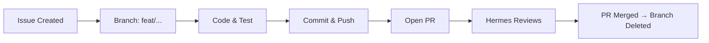

## Summary

<!-- One or two sentences describing what needs to be done and why. -->

## Context

<!--
Explain the background. What problem does this solve?
Link to related issues, discussions, or documentation:
-->

## Requirements

<!--
Checklist of what "done" looks like. Be specific.
-->
- [ ] Requirement 1
- [ ] Requirement 2
- [ ] Requirement 3

## Proposed Approach

<!--
Optional: how you think this should be implemented.
Leave blank if the solution is not yet clear.
-->

## Lifecycle

1. **Issue Created** — This issue describes the task
2. **Branch** — Executor creates `feat/short-description` from `main`
3. **Code & Test** — Write code, test in VM, run shellcheck
4. **Commit & Push** — Conventional Commits message
5. **Open PR** — PR against `main`, reference this issue in body
6. **Review** — Hermes reviews the diff
7. **Merge** — Squash merge, branch deleted

## Files Likely Affected

<!--
List files that will likely be modified.
-->
- `path/to/file.sh`

---

/lifecycle
